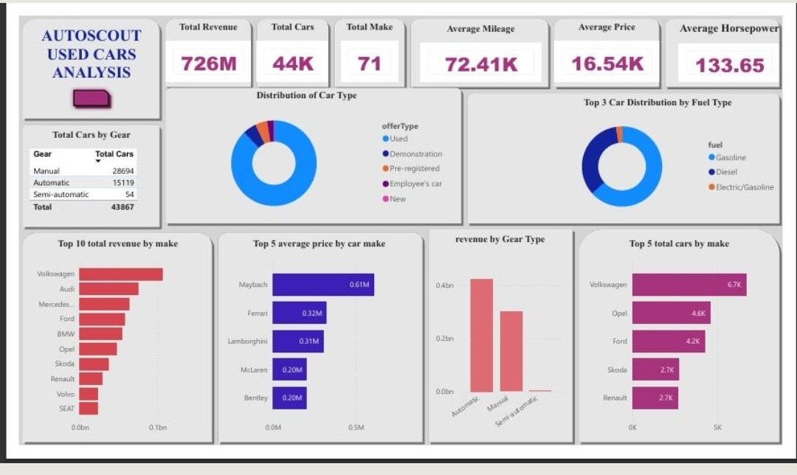

# AutoScout Used Cars Analysis

### Overview
Analyzed 43,867 used car listings from AutoScout platform to understand sales performance, pricing trends, and brand dominance.

### Dataset
- **Source:** AutoScout24
- **Size:** 43,867 cars, 71 makes
- **Fields:** make, price, mileage, horsepower, fuel type, gear type, offer type

### Process - Medallion Architecture
**Bronze:** Ingested raw CSV (44K records)  
**Silver:** Cleaned in SQL - removed null prices, outliers in mileage (>500K km), standardized fuel types  
**Gold:** Created 1 final table for Power BI with KPIs

### Dashboard KPIs (from screenshot)
- **Total Revenue:** 726M
- **Total Cars:** 43,867
- **Total Makes:** 71
- **Avg Price:** 16.54K
- **Avg Mileage:** 72.41K
- **Avg Horsepower:** 133.65

### Key Insights
1.  **Volume King:** Volkswagen is #1 with 6.1K cars, followed by Opel (4.4K) and Ford (3.2K)
2.  **Value King:** Maybach has highest avg price at 0.61M, followed by Ferrari (0.32M) and Lamborghini (0.31M)
3.  **Transmission:** Manual dominates with 28,694 cars (65%) vs Automatic 15,119 - shows European market preference
4.  **Car Type:** Used cars are 85% of inventory, pre-registered and demonstration make small share

### Tools Used
- SQL (MySQL) - Cleaning & Gold KPIs
- Power BI - Dashboard
- GitHub - Documentation

### Dashboard

**Key Visuals:**
- Revenue 726M, 44K cars, 71 makes
- Top Brand: Volkswagen 6.1K
- Price vs Mileage analysis

---
### About Me
Data Analyst in training | SQL, Power BI, Python |  Kenya
Built this project to demonstrate end-to-end analytics: raw data -> cleaning -> dashboard -> insights.
Open to entry-level Data Analyst roles.

### Next Step
Add pricing prediction model to estimate best price by mileage & HP.
